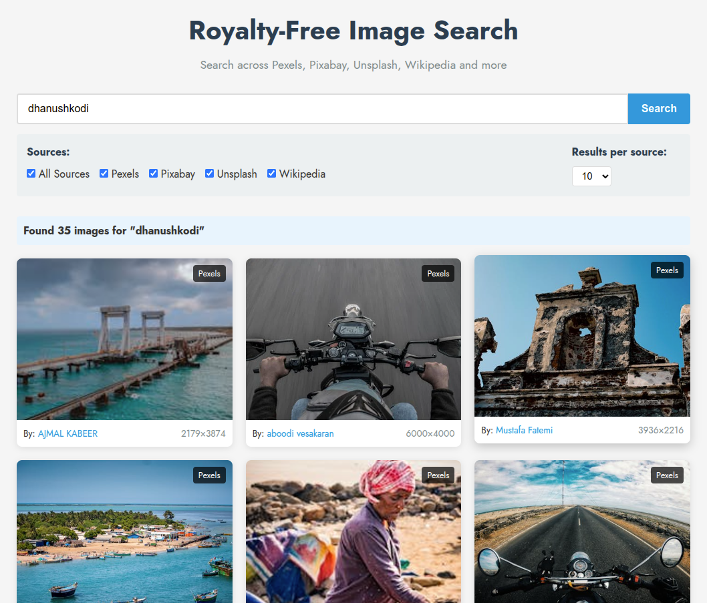

# Royalty Free Image Search

A web application that searches for royalty-free images across multiple platforms including Pexels, Pixabay, Unsplash, and Wikipedia.



## Features

- **Multi-source search**: Find images from Pexels, Pixabay, Unsplash, and Wikipedia in one place
- **Filter by source**: Choose which image sources to include in your search
- **Responsive design**: Works on desktop and mobile devices
- **Image preview**: View full-size images and attribution information
- **Parallel API requests**: Fast search results through concurrent API calls

## Technologies Used

### Backend
- Python 3.10+
- Flask (Web framework)
- Requests (HTTP client)
- Concurrent.futures (Parallel API calls)

### Frontend
- Vue.js 3
- Pure CSS (No external UI frameworks)
- Responsive design

## Prerequisites

- Python 3.10+
- Node.js 14+ and npm
- API keys for Pexels, Pixabay, and Unsplash

## Installation and Setup

### Clone the repository

```bash
git clone https://github.com/yourusername/royalty-free-search.git
cd royalty-free-search
```

### Backend Setup

1. Navigate to the backend directory:
   ```bash
   cd backend
   ```

2. Create a virtual environment:
   ```bash
   python -m venv venv
   source venv/bin/activate  # On Windows: venv\Scripts\activate
   ```

3. Install dependencies:
   ```bash
   pip install -r requirements.txt
   ```

4. Create a `.env` file and add your API keys:
   ```bash
   cp .env.example .env
   # Edit .env to add your API keys
   ```

5. Run the Flask application:
   ```bash
   flask run
   # Or
   python app.py
   ```

### Frontend Setup

1. Navigate to the frontend directory:
   ```bash
   cd frontend
   ```

2. Install dependencies:
   ```bash
   npm install
   ```

3. Create a `.env` file:
   ```bash
   cp .env.example .env
   # Edit .env if needed (API URL, etc.)
   ```

4. Run the development server:
   ```bash
   npm run serve
   ```

## Docker Deployment (Optional)

If you prefer using Docker:

```bash
docker-compose up -d
```

This will start both the backend and frontend services.

## API Keys

You'll need to obtain API keys from the following services:

1. Pexels API: https://www.pexels.com/api/
2. Pixabay API: https://pixabay.com/api/docs/
3. Unsplash API: https://unsplash.com/developers

Wikipedia API does not require an API key.

## License

This project is licensed under the MIT License - see the LICENSE file for details.

## Acknowledgements

- [Pexels](https://www.pexels.com/) - Free stock photos
- [Pixabay](https://pixabay.com/) - Free images and videos
- [Unsplash](https://unsplash.com/) - Beautiful free images
- [Wikipedia](https://www.wikipedia.org/) - Free encyclopedia